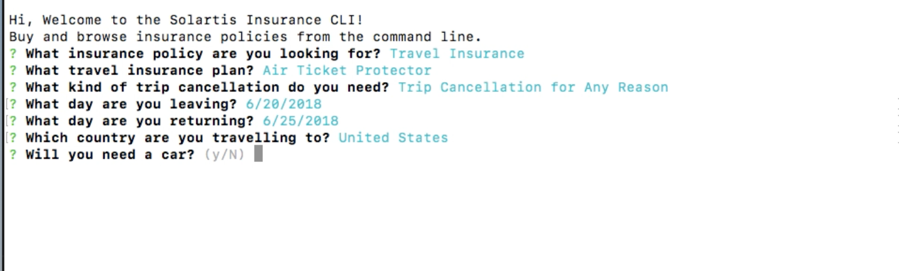
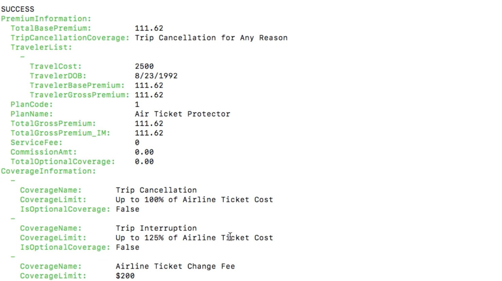
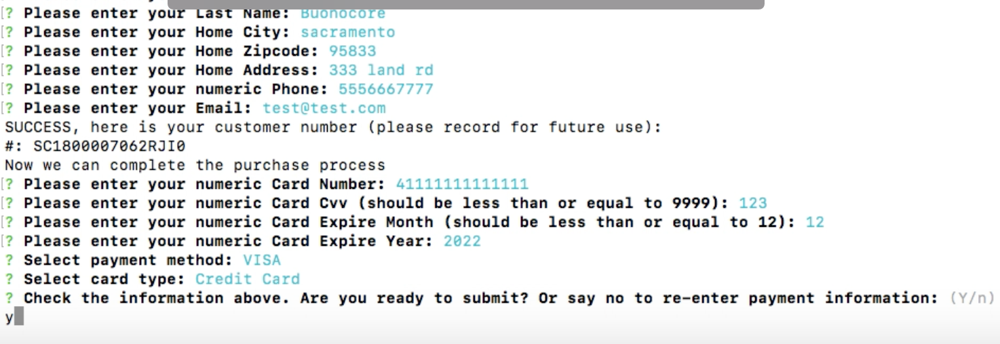

Solartis Insurance API
---
Get Insurance Quotes from the command line!

### Concept

Nobody wants to fill out forms or have phone calls regarding insurance anymore.
This tool allows users to get quotes and purchase insurance directly from the command line.

### Getting Started:
* Download the repo
* Set your api token locally in your environment:
<pre>
    SOLARTIS_TOKEN=<token>
    SOLARTIS_USERNAME=<username> (if undefined set to 'travelagent')
</pre>
* Install dependencies:
<pre>
    npm install
</pre>
* Start the app from the command line.
<pre>
    npm start
</pre>

That's it!

### Demo Video:
This video goes through the user process of buying a new travel insurance policy from the command line in about 90 seconds.

<a href="https://youtu.be/TMai5mufyQA" target="_blank">Demo Video</a>

### Screenshots:

#### Starting the process of a new travel policy quote.

#### Screenshot showing a generated policy.

#### Completing the purchase of the policy

All from the command line.

### Dev Notes for CLI implementation:
* https://github.com/SBoudrias/Inquirer.js/blob/master/packages/inquirer/examples/
